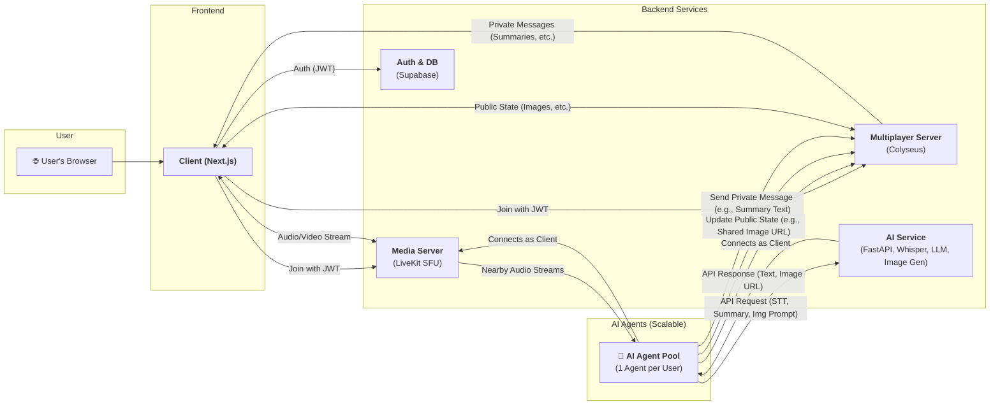

# Project LLMeta

## 概要

Project LLMeta は、ユーザーが共有の 3D 空間でリアルタイムに交流し、AI によるコミュニケーション支援を受けられる軽量な WebXR メタバース体験プロジェクトです。

## 主な機能

- **リアルタイムコミュニケーション:** 最大 10 名のユーザーが、空間オーディオを備えた 3D 空間で円滑に音声会話できます。
- **AI による支援:** 各ユーザーにパーソナライズされた AI エージェントが、会話の要約、解説、関連画像の自動生成など、コミュニケーションを豊かにします。
- **クロスプラットフォーム:** デスクトップブラウザおよび XR デバイスからシームレスにアクセス可能です。

## システムアーキテクチャ

システムは、フロントエンド、バックエンドサービス、AI エージェントの 3 層で構成されています。詳細については `docs/system-architecture.md` を参照してください。



## 技術スタック

主要な技術スタックは以下の通りです。詳細については `docs/technology-stack.ja.md` を参照してください。

- **クライアント (Frontend):** Next.js, TypeScript, React Three Fiber, Colyseus.js, Radix UI, Tailwind CSS
- **サーバー (Backend):** Colyseus, LiveKit, Supabase
- **翻訳・AI API:** FastAPI, SeamlessM4T v2

## ビルドと実行

### 1. Colyseus サーバーの起動

```bash
cd server
npm install
npm start
```

### 2. 翻訳 API の起動

```bash
cd translation-api
uv sync
uv run uvicorn app.main:app --host 0.0.0.0 --port 8000 --reload
```

### 3. Next.js クライアントの起動

```bash
cd client
npm install
npm run dev
```

クライアントは [http://localhost:3000](http://localhost:3000) で利用可能になります。

## ディレクトリ構成

- **`client/`:** 3D ワールドをレンダリングし、ユーザーインタラクションを処理する Next.js フロントエンドアプリケーション。
- **`server/`:** プレイヤーの位置や回転など、メタバースのリアルタイムな状態を管理する Colyseus サーバー。
- **`translation-api/`:** 事前学習済み AI モデルを使用してテキストおよび音声翻訳サービスを提供する Python ベースの API。
- **`docs/`:** 仕様書、アーキテクチャ図、開発計画などのプロジェクトドキュメント。
