# システムアーキテクチャ仕様書 (MVP)

版数: v0.2  
作成日: 2025-09-25  
参照元: `spec.md` (要件定義 v0.1)

---

## 0. 最新実装状況サマリ (2025-09-25)

| 項目                       | 状態      | メモ                                                           |
| -------------------------- | --------- | -------------------------------------------------------------- |
| Colyseus 連携              | ✅ 完了   | `use-colyseus` 経由で `MyRoom` に接続、頭部/手ポーズを配信中。 |
| XR 入力・手ポーズ同期      | 🔄 進行中 | XR トグルと手ポーズ送信は実装済み、アバターモデル統合は未完。  |
| デスクトップ移動 + 補間    | ✅ 完了   | `SimpleCharacter` + 補間フックでリモート表示を滑らかに更新。   |
| LiveKit 空間音声           | ⏳ 未着手 | 現状は WebRTC/オーディオ統合なし。                             |
| AI パネル / Gateway        | ⏳ 未着手 | UI・サーバ両方で未実装。                                       |
| 再接続制御 / ステータス UI | ⏳ 未着手 | 切断リトライ・接続インジケータは未実装。                       |
| VRM 体験ページ             | ✅ 完了   | `/vrm` で VRM 読み込み・表情/アニメ調整が可能。                |

※ 本稿の以降節では、進捗済み部分と未実装部分の双方を明記し、将来拡張の設計意図を維持する。

## 1. 目的

要件定義 (FR/NFR) を実装へ正確にブリッジするために、MVP フェーズで採用する論理/物理構成、データフロー、同期/AI/音声の技術的仕様、性能/品質設計と拡張指針を明示する。コード実装前のレビューおよび変更統制の基礎資料とする。

## 2. ハイレベル構成

```
[Browser Client (Next.js / React / Three.js / WebXR)]
   ├─ UI層 (参加フォーム, HUD, AIパネル)
   ├─ 3D表示層 (Scene Graph, Avatar, Camera Rig)
   ├─ XR入力層 (VR Pose, Controllers, Gestures)
   ├─ 同期制御層 (State Buffer, Interpolation, Rate Control)
   ├─ ネットワーク層
   │    ├─ Colyseus Client (WS)
   │    └─ LiveKit Client (WebRTC: 音声)
   └─ AIパネルロジック (API 呼出し)

[Application Server (Node.js / Colyseus)]
   ├─ Room管理 (MyRoom)
   ├─ State Schema (Players, Gestures, Metadata)
   ├─ メッセージ処理 (位置/回転/ジェスチャー/Event)
   ├─ 再接続ハンドラ / セッション一時キャッシュ
   ├─ AI Gateway Proxy (翻訳/要約/画像生成/会話補助)
   └─ ログ/計測 (最小限)

[LiveKit SFU]
   └─ 音声トラック (位置ベース定位はクライアント側 WebAudio + Panner)

[AI Providers]
   ├─ Translation API
   ├─ Summarization LLM
   ├─ Image Generation
   └─ Prompt Assist (LLM)

> 現状 (v0.2) では LiveKit / AI Provider との接続は未実装であり、図内の該当ブロックは計画段階を示す。クライアントは Colyseus を通じた状態同期のみを行う。
```

## 3. コンポーネント詳細

| 層           | コンポーネント        | 主責務                                       | FR/NFR 関連        | 実装状況 (2025-09-25)                           |
| ------------ | --------------------- | -------------------------------------------- | ------------------ | ----------------------------------------------- |
| クライアント | UI フォーム           | ニックネーム入力/バリデーション              | FR-01,02           | ⏳ 未着手 — 自動参加で sessionId を仮表示中     |
|              | Avatar Manager        | モデルロード / アニメ適用 / ポーズ反映       | FR-03~07           | 🔄 部分実装 — `/vrm` で完了、体験ルーム統合未完 |
|              | Network Sync Module   | 送信頻度制御 / パケット生成 / 補間バッファ   | FR-03,04 / NFR-P01 | ✅ 実装済 — ポーズ送信 + 補間フック稼働         |
|              | XR Input Adapter      | WebXR Pose 取得 / Fallback カメラ操作        | FR-05,06           | 🔄 部分実装 — XR 入力/手ポーズ送信は稼働        |
|              | Spatial Audio Adapter | LiveKit 音声を位置更新で PannerNode に反映   | FR-08,09 / NFR-U01 | ⏳ 未着手 — オーディオ処理なし                  |
|              | AI Panel              | 翻訳/要約 UI/ローディング/エラー表示         | FR-11~14           | ⏳ 未着手                                       |
| サーバ       | Colyseus Room         | 入退室/最大人数制限/イベントブロードキャスト | FR-01,10           | ✅ 実装済 — `maxClients=10` で稼働              |
|              | State Schema          | プレイヤー揮発状態保持 (再接続時再送)        | FR-03~07           | ✅ 実装済 — 頭部/両手座標を保持                 |
|              | AI Gateway            | ベンダー差異吸収 / タイムアウト / リトライ   | FR-11~14           | ⏳ 未着手                                       |
|              | Connection Manager    | 再接続ロジック / セッション復元              | FR-16,17 / NFR-R01 | ⏳ 未着手 — Colyseus 既定挙動のみ               |
| 外部         | LiveKit               | 音声 SFU                                     | FR-08,09           | ⏳ 未接続                                       |
| 外部         | AI APIs               | 翻訳/要約/画像/プロンプト生成                | FR-11~14           | ⏳ 未接続                                       |

## 4. データモデル (実装インタフェース案)

TypeScript インタフェース (クライアント内 / サーバ送受信 DTO 概略):

```ts
// 送信頻度: pose ~20Hz (調整可能)
interface PlayerPoseUpdate {
  t: number; // ms timestamp (client monotonic)
  id: string; // playerId
  p: [number, number, number]; // position (量子化前float)
  r: [number, number, number, number]; // quaternion
  head?: {
    p: [number, number, number];
    r: [number, number, number, number];
    h?: number;
  };
  hands?: { l?: Pose; r?: Pose };
}
interface Pose {
  p: [number, number, number];
  r: [number, number, number, number];
  s?: number;
}

// イベント (低頻度)
interface GestureEvent {
  id: string;
  gesture: number;
  ts: number;
}
interface JoinAck {
  selfId: string;
  players: PlayerSnapshot[];
}
interface PlayerSnapshot {
  id: string;
  nickname: string;
  pose?: PlayerPoseUpdate;
  gesture?: number;
}

// AI 関連
interface AIRequest {
  reqId: string;
  type: "translate" | "summary" | "image" | "assist";
  payload: any;
}
interface AIResponse {
  reqId: string;
  ok: boolean;
  type: AIRequest["type"];
  data?: any;
  error?: string;
  elapsedMs: number;
}
```

### 4.1 量子化 (将来拡張フック)

MVP では生 float32 を JSON 化 → サイズ最適化優先度: 中。P2 で Int16 量子化 (`[-20,20]` 正規化 →`Int16`) 追加予定。インターフェース互換のため `version` フィールド追加余地を確保 (未送信時デフォルト=0)。

## 5. 通信プロトコル & 更新戦略

| 項目         | 方式                              | 頻度 / トリガ                        | 信頼性         | 備考                               |
| ------------ | --------------------------------- | ------------------------------------ | -------------- | ---------------------------------- |
| PoseUpdate   | Colyseus broadcast (patch)        | 20Hz 目標 / 動き無時スロットル (5Hz) | 不要(最新優先) | Sequence 番号 `seq` 付与で遅延判定 |
| GestureEvent | Colyseus message                  | Event                                | At-least-once  | client で重複除去 (gestureId + ts) |
| Join / Leave | Room lifecycle                    | Event                                | 必須           | 10 人制限超過時 `JoinReject`       |
| AIRequest    | HTTP (Server → Provider) / WS Ack | User 操作                            | 必須           | タイムアウト/リトライ制御          |
| AIResponse   | WS to client                      | Provider 完了                        | 必須           | クライアントで reqId 突合          |

現状は `PoseUpdate` と入退室イベントのみが実運用されており、AI 系メッセージは未使用。

### 5.1 レート制御

- クライアント送信キュー: 16ms タイムスライス内最新ポーズのみ保持 (古いもの破棄)。
- サーバ側: 最終受信時刻差分 > 150ms のプレイヤーは補間停止 → フェードアウト扱い。

### 5.2 補間アルゴリズム

```
Receive pose(t0) & pose(t1) → renderTime = now - interpolationDelay( ~50ms )
if renderTime between t0..t1: Lerp position / Slerp rotation
else if renderTime > t1 + grace(100ms): switch to extrapolation (velocity= (p1-p0)/(t1-t0)) up to 250ms cap.
```

## 6. シーケンス (Mermaid)

### 6.1 参加


### 6.2 AI 翻訳


### 6.3 再接続

```mermaid
sequenceDiagram
  participant U as Client
  participant C as Server
  Note over U,C: ネットワーク断 <10s
  U->>C: Reconnect(sessionToken)
  C-->>U: RejoinAck (current players + buffered state)
```



## 7. 空間音声設計

> 実装状況: LiveKit 連携と PannerNode 更新は未着手。以下のパラメータは設計指針として維持する。

| 項目            | 値(初期)          | 調整パラメータ             |
| --------------- | ----------------- | -------------------------- |
| refDistance     | 1.0               | UI 設定 (将来)             |
| maxDistance     | 25.0              | env config                 |
| rolloffFactor   | 1.0 (線形 → 調整) | 0.5~2.0                    |
| coneInner/Outer | 360 / 360         | 将来 head orientation 利用 |

更新: `requestAnimationFrame` 毎に listener/各 PannerNode の position/ orientation 更新。音量 UI ミュート時は GainNode で 0。距離モデル検証 (5m で <=40%) を AC-03 として計測スクリプト用意予定。

## 8. AI Gateway 仕様

> 実装状況: サーバー側の Gateway 抽象・外部 API 呼出しは未着手。UI も未実装。

| 機能      | API 抽象インタフェース        | Timeout | Retry | フィールド最小化     |
| --------- | ----------------------------- | ------- | ----- | -------------------- |
| translate | `translate(text, src, dst)`   | 8s      | 1     | text 長 <= 2k chars  |
| summary   | `summarize(recentMessages[])` | 10s     | 1     | 直近 N(=20) 件のみ   |
| image     | `generateImage(prompt)`       | 25s     | 1     | prompt sanitize      |
| assist    | `assist(context)`             | 8s      | 1     | context トークン削減 |

エラーカテゴリ: `TIMEOUT` / `UPSTREAM_ERROR` / `RATE_LIMIT` / `INVALID_INPUT` / `SANITIZE_BLOCK`. UI はユーザ再試行可能。

## 9. 性能/帯域予算

| 項目               | 目標         | 計算根拠                                              |
| ------------------ | ------------ | ----------------------------------------------------- |
| Pose Packet サイズ | ~180B (JSON) | id(8) + t(4) + p(3*4) + r(4*4) + head(省略可) + delim |
| 平均送信帯域       | <80kbps      | 180B \* 20Hz = 3.6KB/s -> 28.8kbps + overhead         |
| p95 同期遅延       | <=150ms      | WS RTT + server dispatch + interpolation buffer       |
| 初期ロード         | <5s          | モデル/テクスチャプリロード + lazy AI パネル          |

## 10. 信頼性/再接続戦略

- バックオフ: 0.5s,1s,2s,4s,8s,16s (最大 30s cap)
- セッション復元トークン: 初回 JoinAck に含めローカル保持 (localStorage 使用せず揮発: タブリロード時破棄 → 要件 FR-15 を満たすため sessionStorage も使用しない)。
- 再接続成功後: 欠損中の AIResponse は破棄 (クライアント側でリクエスト再送 UI)。

## 11. セキュリティ/プライバシ制御

| 項目       | 対策                                                                                       |
| ---------- | ------------------------------------------------------------------------------------------ |
| 通信暗号化 | HTTPS + WSS / WebRTC DTLS + SRTP                                                           |
| XSS        | AI 結果表示前に DOMPurify 等 (MVP: 簡易エスケープ)                                         |
| 個人情報   | 入力フィールド: nickname(1-24), profileNote(0-140) 以上禁止                                |
| ログ       | サーバ: join/leave/error のみ。AI 入力本文はマスク長 (len) のみ保存 (PoC ではログ無効も可) |

## 12. 設定 (env) 初期キー案

| 変数                     | 用途               | 例                      |
| ------------------------ | ------------------ | ----------------------- |
| LIVEKIT_URL              | LiveKit サーバ URL | wss://audio.example.com |
| LIVEKIT_API_KEY / SECRET | トークン署名用     | \*\*\*\*                |
| AI_PROVIDER              | 抽象スイッチ       | openai / azure / mock   |
| AI_TIMEOUT_MS_TRANSLATE  | Timeout override   | 8000                    |
| MAX_ROOM_CAPACITY        | 参加上限           | 10                      |

## 13. ログ/モニタリング (MVP 最小)

| イベント       | レベル | 例                |
| -------------- | ------ | ----------------- |
| Join/Leave     | info   | playerId, count   |
| CapacityReject | warn   | requested, limit  |
| ReconnectFail  | warn   | playerId, attempt |
| AI Timeout     | error  | type, elapsedMs   |

P2: メトリクス導入 (Prometheus) / p95 送信遅延計測バケット。

## 14. テスト戦略概要

| レイヤ       | テスト種別   | ツール                     | 目的                     |
| ------------ | ------------ | -------------------------- | ------------------------ |
| クライアント | 単体         | Vitest / Jest              | 補間計算, レート制御     |
| サーバ       | 単体         | Jest                       | Room state 変換/容量制限 |
| E2E          | 多人数シミュ | headless (Playwright + WS) | AC-01~02 確認            |
| 負荷         | スクリプト   | server/loadtest/example.ts | 10 クライアント 10 分    |
| 性能         | 計測         | Web Perf API               | 初期ロード時間           |

## 15. リスクと技術的緩和 (詳細)

| リスク          | 詳細                  | 緩和                                    |
| --------------- | --------------------- | --------------------------------------- |
| Pose ジッター   | 不均一間隔受信        | バッファ 50ms + 補間/外挿上限           |
| AI 高遅延       | 外部 API ボトルネック | 並列 + ローディング + cancel トークン   |
| VR デバイス差異 | 座標系/向き違い       | WebXR reference space 統一(local-floor) |
| 音声定位不自然  | レイテンシ/更新遅延   | rAF 更新 & Panner parameters pre-config |

## 16. 将来拡張ポイント (Interface Hooks)

- 量子化: `PoseEncoder` 戦略パターン (raw / quantized)
- マルチルーム: `RoomService` 抽象 + ルーティングテーブル
- 認証: `AuthContext` を Join フローに挿入 (JWT 検証)
- 音声テキスト化 (STT): LiveKit Webhook → Server AI Pipeline

## 17. トレーサビリティ補足

FR/NFR に対する主要コンポーネント対応は §3 表参照。AC とテスト計画のリンクは `development-plan.md` で詳細化。

## 18. 変更管理

`spec.md` に準拠。ブレイキング: プロトコルフィールド追加/削除は `CHANGELOG.md` と schema version increment。

## 19. 次アクション (v0.3 想定)

- LiveKit ベースの空間音声統合とクライアント側 Panner 更新ループの実装。
- Colyseus 再接続ハンドリング (バックオフ UI, 状態再同期) の導入。
- 参加フォーム/UI と表示名の導入、プロフィール情報の送信制御。
- AI Gateway 抽象のスケルトン実装とモック応答での UI 開発。
- リモートプレイヤーに VRM アバターを適用し、手/頭ポーズの駆動に対応。

---

(End of Document)
