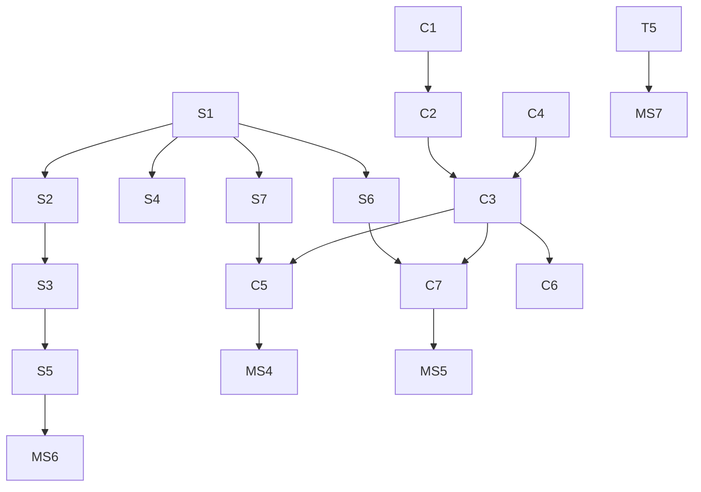

# 開発計画 & マイルストーン (MVP フェーズ)

版数: v0.2  
更新日: 2025-09-25  
参照: `spec.md`, `architecture.md`

---

## 0. 進捗サマリ (2025-09-25)

- ✅ Colyseus ルームとクライアント接続の基本が稼働し、頭部/手ポーズの同期まで確認済み。
- ✅ デスクトップ操作とリモート補間の実装により、最低限の同期体験が可能。
- 🔄 XR 入力・手ポーズ送信は実装済みだが、アバター適用・UI/入室フローは未完。
- ⏳ LiveKit 空間音声、AI パネル、再接続 UI、負荷試験などは未着手。今後の優先度が高い。
- ⚠️ 進捗遅延: MS4 以降の機能は着手前のため、スケジュール再見直しが必要。

## 1. ゴール定義

MVP (Phase 1) にて AC-01~06 を満たし、最大 10 名同時参加で安定した音声 + 位置同期 + 基本 AI (翻訳/要約) 機能を提供する。映像/リップシンク/複数ルーム/画像生成は後続。P2 で画像生成/会話補助、P3 でスケールアウト/高度アバター機能を見据えた基盤維持。

## 2. スコープ (再掲簡略)

Must: Join, Pose Sync, Spatial Audio, Reconnect Handling, Translation, Basic Summary, Error UI.  
Should: Gestures, Connection Indicators.  
Could (条件付き一部): Image Generation(後半検討)/Assist Prompt (P2 推奨)。

## 3. マイルストーン一覧 (W = 週)

| MS  | 目標                         | 期間 | 成果物                                        | 受入基準フォーカス                | 状態 (2025-09-25)              |
| --- | ---------------------------- | ---- | --------------------------------------------- | --------------------------------- | ------------------------------ |
| MS1 | 基盤セットアップ             | W1   | Repo 構成/Colyseus Room 雛形/LiveKit 接続 PoC | 初回 Join/Leave 可能              | ✅ 完了 (LiveKit PoC は未着手) |
| MS2 | 位置/回転同期 + 補間         | W1-2 | PoseUpdate 実装/補間モジュール                | AC-02 下準備 (レイテンシ局所測定) | ✅ 完了                        |
| MS3 | VR/XR 入力 & ハンド/頭部反映 | W2-3 | WebXR Adapter/Avatar 反映                     | VR HMD で頭部/手同期              | 🔄 進行中 (手同期/送信は完了)  |
| MS4 | 空間音声統合                 | W3   | LiveKit + PannerNode 距離減衰                 | AC-03 測定スクリプト初版          | ⏳ 未着手                      |
| MS5 | AI 翻訳/要約                 | W3-4 | AI Gateway + UI                               | AC-05 前半測定                    | ⏳ 未着手                      |
| MS6 | 再接続/エラーハンドリング    | W4   | バックオフ/インジケータ                       | AC-04 検証通過                    | ⏳ 未着手                      |
| MS7 | 安定化/負荷試験              | W5   | 自動負荷スクリプト/性能ログ                   | AC-01,02,03 確定測定              | ⏳ 未着手                      |
| MS8 | リリース準備                 | W6   | ドキュメント/デモ動画                         | 全 AC チェックリスト合格          | ⏳ 未着手                      |

バッファ: 1 週 (リスク緩和用)。

## 4. 作業ブレークダウン (主タスク)

### 4.1 クライアント

- [x] C1: Three.js シーンベース/カメラリグ雛形
- [~] C2: Avatar Loader (VRM) + 非同期フェードイン — `/vrm` では完了、体験シーン連携は未了
- [x] C3: Pose 送信レート制御 + Interpolation Buffer
- [~] C4: XR Input Adapter / fallback controls — XR モード切替・手ポーズ送信まで実装
- [ ] C5: Spatial Audio Adapter (PannerNode 配線)
- [ ] C6: Gesture UI + イベント送出
- [ ] C7: AI パネル (翻訳/要約) + 状態管理 (loading/error)
- [ ] C8: 接続ステータスインジケータ (Colyseus/LiveKit)
- [ ] C9: Error/Retry トーストコンポーネント

### 4.2 サーバ

- [x] S1: Colyseus MyRoom スケルトン (容量制御)
- [x] S2: State Schema (Players / Gestures) — 現状ジェスチャーフィールド未使用
- [x] S3: Pose Update Handling + Broadcast (差分最適化パッチ)
- [ ] S4: Gesture Event Handling (idempotent)
- [ ] S5: Reconnect セッションハンドリング (短期再参加)
- [ ] S6: AI Gateway 抽象 & Provider 実装 (Mock → 本番)
- [ ] S7: LiveKit トークン発行エンドポイント (音声)
- [ ] S8: Metrics/Logging 最小

### 4.3 テスト / ツール

- [ ] T1: 補間アルゴ単体テスト (境界: 欠損/外挿上限)
- [ ] T2: Room 容量 / JoinReject テスト
- [ ] T3: Reconnect シナリオ (ネットワーク切断シミュレーション)
- [ ] T4: AI Timeout / Retry モックテスト
- [ ] T5: 負荷試験 (10 Bots 10 分) スクリプト & レポート
- [ ] T6: Spatial Audio 物理検証 (5m 距離音圧比計測) ※自動化は簡易ログ

## 5. タスク依存関係 (Mermaid)

> 進捗メモ: S1, S2, S3 は完了済み。S4/S5 以降および T5 以降はこれから着手。

## 6. 計測 & 品質ゲート

> 現時点で自動計測・ログ収集は未整備。MS4 以降で順次着手予定。

| ゲート        | 基準                      | 測定方法                          |
| ------------- | ------------------------- | --------------------------------- |
| G1: Build     | CI 通過                   | lint + typecheck + unit tests     |
| G2: Latency   | p95 <=150ms               | Bot シミュ (WS RTT + client logs) |
| G3: Audio     | 5m 音量 <= 1m の 40%      | gain 倍率サンプリング             |
| G4: Reconnect | 5s 遮断 → 10s 復帰        | NetLink 切断スクリプト            |
| G5: AI 成功率 | 翻訳 10 回中 >=9 回 8s 内 | Gateway ログ集計                  |
| G6: Resource  | CPU/GPU 72fps 目標        | rAF frame time 平均/最大          |

## 7. 実装スタイルガイド (抜粋)

- TypeScript strict mode。
- DTO / 内部型は `types/` ディレクトリ整理 (後で導入)。
- 公開 API 改変は PR に `breaking-change` ラベル。
- Magic number 回避: env or const モジュール化。
- エラー分類: `ErrorCode` 列挙 (AI / Network / Capacity)。

## 8. ブランチ / Git 運用

| 項目       | ルール                                           |
| ---------- | ------------------------------------------------ |
| main       | デプロイ可能 / バージョンタグ付与 (MVP 前は随時) |
| feature/\* | 単機能 (C3, S3 など)                             |
| chore/\*   | 依存更新/設定                                    |
| hotfix/\*  | 緊急修正                                         |

コミット prefix: `feat:`, `fix:`, `perf:`, `refactor:`, `test:`, `chore:`。  
PR テンプレ: 変更概要 / 動作確認 / スクリーンショット / 関連 Issue。

## 9. リスク対応トラッキング

| ID              | 状態 | 対策進捗                        |
| --------------- | ---- | ------------------------------- |
| R1 (ジッター)   | 部分 | C3 実装で補間追加。評価は未実施 |
| R2 (AI 遅延)    | 未   | S6 タイムアウト + ローディング  |
| R3 (XR 差異)    | 部分 | C4 で feature detect 実装済     |
| R4 (再接続失敗) | 未   | S5 & T3 強化                    |
| R5 (帯域超過)   | 未   | C3 動き無時スロットル (要調整)  |

## 10. デモ / 検証フロー

1. 3 クライアント (デスクトップ 2, Quest 1) 接続。
2. 位置同期: 片方の移動 → 他 2 へ <150ms 体感。
3. 音声: 1m / 5m 離れてゲイン差手動確認。
4. 翻訳リクエスト連続 10 回。
5. ネット遮断 (DevTools offline) 5s → 自動復帰。
6. リロードして NICNAME 再入力 (永続なし確認)。

## 11. リリース判定チェックリスト (抜粋)

| 項目         | OK 条件              | 状態 |
| ------------ | -------------------- | ---- |
| 人数上限     | 11 人目拒否          |      |
| レイテンシ   | p95 <=150ms 測定ログ |      |
| 再接続       | 遮断試験合格         |      |
| 翻訳         | 成功率基準           |      |
| 音声距離減衰 | 5m <= 40%            |      |
| 永続化なし   | リロードリセット     |      |

## 12. 次フェーズ (P2) プレビュー

- 画像生成 UI (placeholder → 実画像) / 失敗ハンドリング。
- 会話補助テンプレ + コンテキスト最適化。
- 量子化実装 (帯域 30% 削減目標)。
- Prometheus メトリクス とダッシュボード。

## 13. 変更管理

本ドキュメント変更は PR でレビュア 1 名以上の承認必須。主要マイルストーン変更は Issue で議論後更新。

---

(End of Document)
