# System Architecture Diagram

This document provides a visual representation of the current and considered system architecture for the LLM Metaverse project. The diagram is created using Mermaid and reflects the ongoing design discussions.

**Note:** This architecture is flexible and subject to change as the project evolves. Dotted lines and components represent future considerations or alternative options.

```mermaid
graph LR
    subgraph "User"
        UserBrowser["🌐 User's Browser"]
    end

    subgraph "Frontend"
        Client["<b>Client (Next.js)</b>"]
    end

    subgraph "Backend Services"
        Colyseus["<b>Multiplayer Server</b><br/>(Colyseus)"]
        LiveKit["<b>Media Server</b><br/>(LiveKit SFU)"]
        Supabase["<b>Auth & DB</b><br/>(Supabase)"]
        AIService["<b>AI Service</b><br/>(FastAPI, Whisper, LLM, Image Gen)"]
    end

    subgraph "AI Agents (Scalable)"
        AIAgentPool["🤖 <b>AI Agent Pool</b><br/>(1 Agent per User)"]
    end

    UserBrowser --> Client

    Client -- "Auth (JWT)" --> Supabase
    Client -- "Join with JWT" --> Colyseus
    Client -- "Join with JWT" --> LiveKit

    Colyseus -- "Public State (Images, etc.)" <--> Client
    Colyseus -- "Private Messages (Summaries, etc.)" --> Client
    LiveKit -- "Audio/Video Stream" <--> Client

    %% AI Agent Flow
    AIAgentPool -- "Connects as Client" --> LiveKit
    AIAgentPool -- "Connects as Client" --> Colyseus

    LiveKit -- "Nearby Audio Streams" --> AIAgentPool
    AIAgentPool -- "API Request (STT, Summary, Img Prompt)" --> AIService
    AIService -- "API Response (Text, Image URL)" --> AIAgentPool

    AIAgentPool -- "Update Public State (e.g., Shared Image URL)" --> Colyseus
    AIAgentPool -- "Send Private Message (e.g., Summary Text)" --> Colyseus
```

